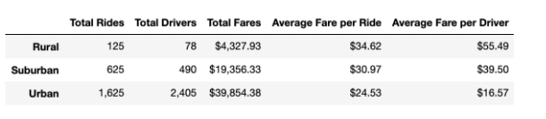
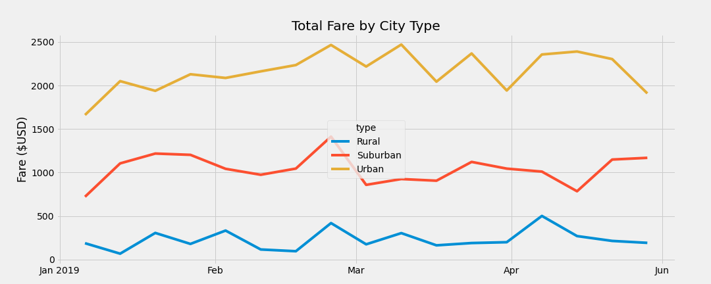

# Overview
Leadership at PyBer requested an exploratory analysis be done on city and ride date from January through May 2019. Leadership would like three recommendations to expand into underserved communities.

# Results

## Total Rides
Urban cites make up the most number of rides. They make up  68% of the total rides. Rural cities make up only 5% of total rides.

## Total Drivers
Urban cities have the largest number or drivers. Urban cities have a total of 2405 drivers which is just over 80% of total drivers.

## Total Fares
The urban cities make up majority of the total fares. The rural fares make up a small portion of total fares.

## Average Fare per Ride
The average fare per rides starts to tell a different story. Rural cities tend to have a larger average fare per ride at $34.62. The urban areas have the lowest average fare per ride at $24.53. Suburban cities fall in the middle at $30.97.

## Average Fare per Driver
The average fare per driver shows an even wider disparity between rural and urban areas. The average fare per driver in rural areas is $55.49, $39.50 for suburban, and a low $16.57 for urban areas.

## Weekly Fares by City Type

The weekly fares show that urban cities make of the most fares by week. Surburban cities are next highest and the rural cities make up the least amount.

# Summary
Base on the analysis above there are a few things that may be able to improve PyBer financial results. The first recommendation is to look for ways to increase rides in rural communities. Rural communities tend to have larger fares. To go along with this first recommendation, we probably need to increase the number of drivers to support increased demand. Another recommendation would be to look for ways to decrease the number of drivers in urban areas. This would then increase the average fare per driver. 
