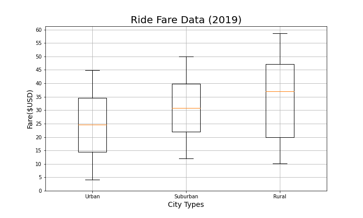
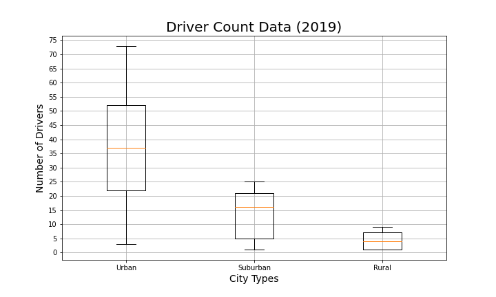

# Overview
Leadership at PyBer requested an exploratory analysis be done on city and ride date from January through May 2019.

# Results

## Average Fare
The average fare is highest in the rural city types, even though they tend to have a lower number of rides. Urban areas tend to have more rides, but the average fares are lower. Suburban city types fall between rurual and urban in terms of average fare and number of rides.

## Ride Count
Urban riders have the highest number of average rides. There is one outlier at 39 rides. The Urban riders also have the widest range of rides. The rural city rides frequent our service left often. The urban riders average 4 times as many rides as our rural riders. Again, suburban riders fall between urban and rural riders.

## Ride Fare
The average fare for rural rides are higher than both suburban and urban rides. The range for rural rides is also more than urban and suburban. Suburban riders have the smallest range.

## Driver Count
Rural cities have the least amount of drivers. Suburban cities have 4 times more drivers than rural cities and urban cities tend to have 9 times more drivers than the rural cities. The rural cities have a very narrow number of driver while the urban cities have a large range of drivers.

## Total Fares by City
Urban cities make up almost 2/3 of total fares while suburban make up 30% of fares. Rural contributes the least amount of fares at just under 7%.

## Total Rides by City Type
Urban cities make up almost 69% of total rides. Surbuban rides make up 26% and rural makes up the least at just over 5%.

## Total Drivers by City Type
Urban cities have the most number of drivers. They make up 81% of total drivers. Suburban and rural make up the remaining 16.5% and 2.6%, respectively.

## Weekly Fares by City Type
As with other the other metrics reviewed, urban cities make up the most fares each week.

# Summary
Base on the analysis above there are a few things that may be able to improve PyBer financial results. The first recommendation is to look for ways to increase rides in rural communities. Rural communities tend to have larger fares. To go along with this first recommendation, we probably need to increase the number of drivers to support increased demand. Another recommendation would be to look for ways to decrease the number of drivers in urban areas. This would then increase the average fare per driver. 
